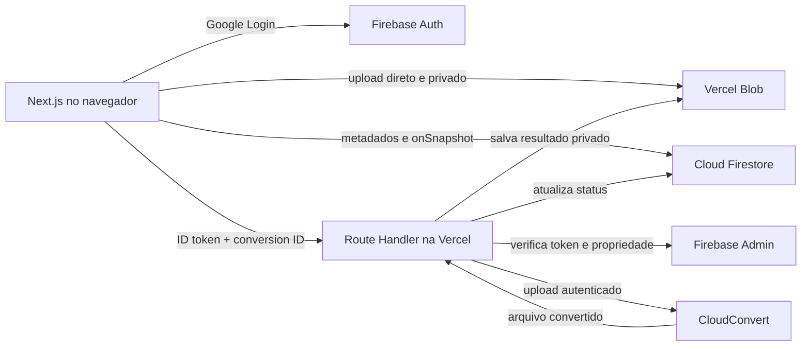

# Converta

Web app para converter DOCX em PDF e PDF em DOCX, com autenticação Google, arquivos privados e histórico em tempo real.

## Arquitetura



O arquivo original não atravessa o corpo da Function. Isso evita o limite de payload de 4,5 MB da Vercel. A Function recebe somente o ID da conversão, cria uma URL de leitura temporária e entrega essa referência ao provedor.

## Decisão do provedor

O adapter inicial é o **CloudConvert**. Ele suporta DOCX → PDF e PDF → DOCX, jobs assíncronos, upload privado e exportação temporária.

O **ConvertAPI** também suporta os dois sentidos e é uma alternativa viável. CloudConvert foi escolhido pelo modelo de jobs e pelo SDK oficial para Node.js.

O contrato `ConversionProvider` isola o fornecedor em `src/lib/conversion`. A chave fica exclusivamente no servidor.

- [CloudConvert API](https://cloudconvert.com/api/v2)
- [CloudConvert pricing](https://cloudconvert.com/pricing)
- [ConvertAPI PDF to DOCX](https://www.convertapi.com/pdf-to-docx)
- [Vercel Functions limits](https://vercel.com/docs/functions/limitations)

## Stack

- Next.js 16, React 19 e TypeScript
- Tailwind CSS 4
- Firebase Auth, Firestore e Admin SDK
- Vercel Blob privado
- CloudConvert API v2
- Vitest
- Vercel

## Desenvolvimento

Requisitos: Node.js 20.9 ou superior e um projeto Firebase.

```bash
npm install
copy .env.example .env.local
npm run dev
```

Abra `http://localhost:3000`.

## Configuração do Firebase

1. Crie um projeto no [Firebase Console](https://console.firebase.google.com/).
2. Em **Authentication > Sign-in method**, ative Google.
3. Crie o Firestore em modo de produção.
4. Registre um Web App e copie os valores públicos para `.env.local`.
5. Em **Project settings > Service accounts**, gere uma chave para o Admin SDK.
6. Cadastre `FIREBASE_ADMIN_PROJECT_ID`, `FIREBASE_ADMIN_CLIENT_EMAIL` e `FIREBASE_ADMIN_PRIVATE_KEY`.
7. Publique regras e índices:

```bash
npx firebase-tools login
npx firebase-tools use --add
npx firebase-tools deploy --only firestore:rules,firestore:indexes
```

Na Vercel, mantenha a chave privada em uma única linha, com quebras representadas por `\n`. O código converte essas sequências de volta para quebras reais.

Adicione `localhost` e o domínio final da Vercel em **Authentication > Settings > Authorized domains**.

## Configuração do Vercel Blob

Crie uma Blob Store privada conectada ao projeto Vercel. A variável
`BLOB_READ_WRITE_TOKEN` é adicionada automaticamente aos ambientes conectados.

## Configuração do CloudConvert

1. Crie uma conta no [CloudConvert](https://cloudconvert.com/).
2. Gere uma API key com permissões `task.read` e `task.write`.
3. Defina:

```env
CONVERSION_PROVIDER=cloudconvert
CONVERSION_API_KEY=sua-chave
```

As conversões reais só funcionam com essa credencial. O projeto não simula conversão nem troca apenas a extensão.

## Variáveis

Todas estão documentadas em `.env.example`. Variáveis `NEXT_PUBLIC_*` entram no bundle do navegador. Credenciais Admin e do provedor nunca usam esse prefixo.

O limite padrão é 10 MB e deve permanecer igual em:

- `NEXT_PUBLIC_MAX_FILE_SIZE_MB`
- `CONVERSION_MAX_FILE_SIZE_MB`

Para preservar o plano gratuito do CloudConvert, a aplicação também aplica uma
cota atômica no Firestore antes de iniciar cada processamento:

- `CONVERSION_DAILY_GLOBAL_LIMIT=10`: tentativas diárias em todo o serviço.
- `CONVERSION_DAILY_USER_LIMIT=2`: tentativas diárias por conta.
- `CONVERSION_COOLDOWN_SECONDS=60`: intervalo mínimo entre tentativas.

As cotas usam dias UTC e são renovadas automaticamente à meia-noite UTC. Os
documentos internos ficam em `conversionQuotas/{AAAA-MM-DD}` e só podem ser
acessados pelo Firebase Admin no backend.
- `firestore.rules`

## Segurança

- ID token validado em toda rota privada.
- UID sempre obtido do token, nunca do corpo.
- Propriedade conferida no Firestore.
- Claim transacional impede processamento duplicado.
- Extensão, tamanho, estado e ID são validados no servidor.
- Caminhos usam UID e conversion ID previsíveis e privados.
- Resultados só são escritos pelo Admin SDK.
- Downloads usam URLs assinadas por cinco minutos.
- Mensagens externas são reduzidas antes de chegar ao cliente.
- Tokens e conteúdo dos arquivos não são registrados.

As regras permitem ao cliente somente criar a conversão e concluir a etapa de upload. Campos de processamento, saída e conclusão pertencem ao servidor.

## Retenção

O documento recebe `expiresAt` sete dias após a conclusão ou falha e pode ser excluído manualmente no dashboard. O Vercel Cron chama diariamente `/api/cron/cleanup`, remove os blobs vencidos e apaga seus documentos do Firestore.

Defina um valor aleatório e longo para `CRON_SECRET` na Vercel. A plataforma envia esse segredo no cabeçalho `Authorization` ao executar o Cron.

## Monitoramento

- `/api/health` confirma publicamente que a aplicação está online.
- Com `Authorization: Bearer HEALTHCHECK_SECRET`, a mesma rota valida Firestore e a configuração de Blob e CloudConvert.
- Erros de servidor são gravados como JSON nos Runtime Logs da Vercel.
- `ERROR_WEBHOOK_URL` é opcional e encaminha os mesmos erros para um endpoint externo.
- Vercel Web Analytics e Speed Insights acompanham acesso e Core Web Vitals.

## Testes

```bash
npm run lint
npm test
npm run build
```

Os testes cobrem validação, tamanho, nomes de saída, transições, prevenção de reprocessamento e adapter do provider.

## Deploy na Vercel

1. Crie um repositório GitHub sem incluir `.env.local`.
2. Importe o repositório em [Vercel](https://vercel.com/new).
3. Cadastre todas as variáveis de `.env.example`.
4. Faça o primeiro deploy.
5. Adicione o domínio Vercel aos domínios autorizados do Firebase Auth.
6. Atualize `NEXT_PUBLIC_APP_URL` com a URL final e publique novamente.
7. Valide login, upload nos dois formatos, conclusão, download, retry e exclusão.

O processamento usa `maxDuration = 300`. Confirme que o plano Vercel escolhido suporta essa duração. Arquivos de até 10 MB cabem na memória durante a gravação do resultado, mas conversões maiores devem migrar para um worker dedicado ou exportação direta para armazenamento compatível.

## GitHub

Antes de publicar:

```bash
git init
git add .
git status
git commit -m "feat: build Converta MVP"
```

Nenhum commit, repositório remoto ou push é criado automaticamente.

## Roadmap

- Limpeza automática de arquivos expirados
- Testes de regras com Firebase Emulator Suite
- Rate limiting distribuído
- Filtros e busca no histórico
- Conversão em lote
- PWA e analytics com consentimento

## Riscos conhecidos

PDF → DOCX é uma reconstrução e pode perder detalhes em layouts complexos, fontes incomuns ou documentos digitalizados. Os arquivos também são processados por um terceiro; documentos altamente sensíveis não devem ser enviados sem uma análise jurídica e contratual do provedor.
